# EventChurch - Gestor de Eventos para Iglesias

## 📋 Descripción

**EventChurch** es una aplicación web diseñada para gestionar eventos y tareas en el contexto de iglesias evangélicas. Permite a los líderes y organizadores crear eventos, asignar tareas a encargados específicos, y visualizar el porcentaje de avance de cada evento en tiempo real.

### Características principales

- Gestión completa de eventos: Crear, leer, actualizar y eliminar eventos
- Gestión de tareas: Asignar tareas a encargados con fechas límite
- Seguimiento de progreso: Visualización del avance mediante barras de progreso y gráfico circular
- Filtros: Filtrar eventos por tipo (Misiones, Familias, Aniversario, etc.)
- API REST: Endpoints completos para integración con otras aplicaciones
- Diseño moderno: Interfaz elegante y sobria con Bootstrap 5

## 🚀 Tecnologías utilizadas

| Tecnología | Versión | Propósito |
|------------|---------|-----------|
| Flask | 3.1.3 | Framework web principal |
| SQLite | 3 | Base de datos ligera |
| Bootstrap | 5.3.0 | Diseño y estilos |
| Chart.js | 4.4.0 | Gráficos circulares |
| Font Awesome | 6.4.0 | Iconos |
| PythonAnywhere | - | Despliegue en producción |

## 📦 Instalación local

### 1. Clonar el repositorio

git clone https://github.com/tu-usuario/eventchurch.git
cd eventchurch

### 2. Crear entorno virtual

python -m venv venv

Windows:
venv\Scripts\activate

Linux/Mac:
source venv/bin/activate

### 3. Instalar dependencias

pip install -r requirements.txt

### 4. Ejecutar la aplicación

python app.py

### 5. Abrir en navegador

http://127.0.0.1:5000/

## 🗄️ Base de datos

El proyecto utiliza SQLite, una base de datos ligera que se guarda en un archivo eventchurch.db.

Las tablas se crean automáticamente al iniciar la aplicación con datos de prueba precargados.

### Estructura de la base de datos

#### Tabla: eventos

| Campo | Tipo | Descripción |
|-------|------|-------------|
| id | INTEGER PRIMARY KEY | Identificador único |
| nombre | TEXT | Nombre del evento |
| descripcion | TEXT | Descripción del evento |
| fecha_inicio | TEXT | Fecha de inicio (YYYY-MM-DD) |
| fecha_fin | TEXT | Fecha de fin (YYYY-MM-DD) |
| ubicacion | TEXT | Lugar del evento |
| estado | TEXT | PLANEADO, EN_PREPARACION, EN_CURSO, FINALIZADO, CANCELADO |
| tipo_evento | TEXT | MISIONES, FAMILIAS, ANIVERSARIO, DIA_ESPECIAL, RETIRO, SOLIDARIO, OTRO |

#### Tabla: tareas

| Campo | Tipo | Descripción |
|-------|------|-------------|
| id | INTEGER PRIMARY KEY | Identificador único |
| titulo | TEXT | Título de la tarea |
| descripcion | TEXT | Descripción de la tarea |
| evento_id | INTEGER | FOREIGN KEY → eventos(id) |
| encargado | TEXT | Persona responsable |
| fecha_limite | TEXT | Fecha límite (YYYY-MM-DD) |
| completada | INTEGER | 0 = Pendiente, 1 = Completada |

## 🔗 Endpoints de la API

### Eventos

| Método | Endpoint | Descripción | Código de éxito |
|--------|----------|-------------|-----------------|
| GET | /api/eventos/ | Listar todos los eventos | 200 |
| GET | /api/eventos/<id>/ | Obtener un evento específico | 200 |
| POST | /api/eventos/ | Crear un nuevo evento | 201 |
| PUT | /api/eventos/<id>/ | Actualizar un evento | 200 |
| DELETE | /api/eventos/<id>/ | Eliminar un evento | 200 |

### Tareas

| Método | Endpoint | Descripción | Código de éxito |
|--------|----------|-------------|-----------------|
| GET | /api/tareas/ | Listar todas las tareas | 200 |
| GET | /api/tareas/<id>/ | Obtener una tarea específica | 200 |
| POST | /api/tareas/ | Crear una nueva tarea | 201 |
| PUT | /api/tareas/<id>/ | Actualizar una tarea | 200 |
| DELETE | /api/tareas/<id>/ | Eliminar una tarea | 200 |

### Estadísticas y filtros

| Método | Endpoint | Descripción | Código de éxito |
|--------|----------|-------------|-----------------|
| GET | /api/resumen/ | Estadísticas generales del sistema | 200 |
| GET | /api/eventos/filtro/?tipo=MISIONES | Filtrar eventos por tipo | 200 |
| GET | /api/eventos/filtro/?estado=EN_CURSO | Filtrar eventos por estado | 200 |

### Ejemplo de respuesta GET /api/eventos/

{
  "total": 3,
  "eventos": [
    {
      "id": 1,
      "nombre": "Conferencia de Misiones 2026",
      "descripcion": "Conferencia anual de misiones con invitados especiales",
      "fecha_inicio": "2026-08-15",
      "fecha_fin": "2026-08-17",
      "ubicacion": "Templo Central",
      "estado": "PLANEADO",
      "tipo_evento": "MISIONES",
      "porcentaje_avance": 0
    },
    {
      "id": 2,
      "nombre": "Celebración 15° Aniversario",
      "descripcion": "Celebración del 15 aniversario de la iglesia",
      "fecha_inicio": "2026-05-20",
      "fecha_fin": "2026-05-20",
      "ubicacion": "Templo Central",
      "estado": "EN_PREPARACION",
      "tipo_evento": "ANIVERSARIO",
      "porcentaje_avance": 100
    },
    {
      "id": 3,
      "nombre": "Retiro de Familias",
      "descripcion": "Retiro espiritual para familias",
      "fecha_inicio": "2026-07-10",
      "fecha_fin": "2026-07-12",
      "ubicacion": "Centro de Retiros El Shaddai",
      "estado": "PLANEADO",
      "tipo_evento": "FAMILIAS",
      "porcentaje_avance": 0
    }
  ]
}

### Ejemplo de petición POST /api/eventos/

Body (JSON):
{
  "nombre": "Campaña Solidaria 2026",
  "descripcion": "Recolección de alimentos para familias necesitadas",
  "fecha_inicio": "2026-06-25",
  "fecha_fin": "2026-06-25",
  "ubicacion": "Templo Central",
  "tipo_evento": "SOLIDARIO",
  "estado": "PLANEADO"
}

Respuesta (201 Created):
{
  "mensaje": "Evento creado correctamente",
  "evento": {
    "id": 4,
    "nombre": "Campaña Solidaria 2026",
    "descripcion": "Recolección de alimentos para familias necesitadas",
    "fecha_inicio": "2026-06-25",
    "fecha_fin": "2026-06-25",
    "ubicacion": "Templo Central",
    "estado": "PLANEADO",
    "tipo_evento": "SOLIDARIO"
  }
}

### Ejemplo de petición POST /api/tareas/

Body (JSON):
{
  "titulo": "Preparar material gráfico",
  "descripcion": "Diseñar afiches y banners para el evento",
  "evento_id": 1,
  "encargado": "Carlos Ruiz",
  "fecha_limite": "2026-07-30"
}

Respuesta (201 Created):
{
  "mensaje": "Tarea creada correctamente",
  "tarea": {
    "id": 4,
    "titulo": "Preparar material gráfico",
    "descripcion": "Diseñar afiches y banners para el evento",
    "evento_id": 1,
    "encargado": "Carlos Ruiz",
    "fecha_limite": "2026-07-30",
    "completada": 0
  }
}

### Ejemplo de respuesta GET /api/resumen/

{
  "total_eventos": 3,
  "total_tareas": 3,
  "tareas_completadas": 1,
  "tareas_pendientes": 2,
  "eventos_por_tipo": {
    "MISIONES": 1,
    "ANIVERSARIO": 1,
    "FAMILIAS": 1
  },
  "eventos_por_estado": {
    "PLANEADO": 2,
    "EN_PREPARACION": 1
  }
}

## 🎨 Estructura del proyecto

eventchurch/
├── app.py                          # Archivo principal de la aplicación
├── requirements.txt                # Dependencias del proyecto
├── eventchurch.db                  # Base de datos SQLite (se crea automáticamente)
├── README.md                       # Documentación del proyecto
├── templates/
│   ├── base.html                   # Template base con navbar
│   ├── inicio.html                 # Página de inicio con estadísticas
│   ├── lista_eventos.html          # Lista de eventos
│   ├── detalle_evento.html         # Detalle de evento con tareas
│   ├── lista_tareas.html           # Lista de todas las tareas
│   ├── detalle_tarea.html          # Detalle de tarea
│   ├── form_evento.html            # Formulario crear/editar evento
│   ├── form_tarea.html             # Formulario crear/editar tarea
│   ├── confirmar_eliminar.html     # Confirmación de eliminación
│   └── 404.html                    # Página de error personalizada
└── evidencias_hito3/               # Capturas de pantalla
    ├── 01_inicio.png
    ├── 02_lista_eventos.png
    ├── 03_detalle_evento.png
    ├── 04_form_crear_evento.png
    ├── 05_form_editar_evento.png
    ├── 06_confirmar_eliminar.png
    ├── 07_filtro_eventos.png
    ├── 08_form_crear_tarea.png
    ├── 09_api_get_eventos.png
    ├── 10_api_get_detalle.png
    ├── 11_api_post_evento.png
    ├── 12_api_put_evento.png
    ├── 13_api_post_tarea.png
    ├── 14_api_delete_evento.png
    ├── 15_api_validation_error.png
    ├── 16_api_resumen.png
    └── 17_despliegue.png

## 🎨 Paleta de colores

| Color | Hex | Uso |
|-------|-----|-----|
| Azul Profundo | #1A2A4A | Navbar, títulos principales |
| Gris Claro | #F5F6FA | Fondo de página |
| Blanco | #FFFFFF | Tarjetas, tablas |
| Gris Medio | #6B7280 | Texto secundario |
| Gris Oscuro | #1F2937 | Texto principal |
| Acento Azul | #3B82F6 | Botones primarios, enlaces |
| Acento Verde | #10B981 | Botones de éxito, completado |
| Acento Ámbar | #F59E0B | Advertencias, pendiente |
| Acento Rojo | #EF4444 | Eliminar, errores |

## 📋 Rutas HTML

| URL | Template | Descripción |
|-----|----------|-------------|
| / | inicio.html | Página de inicio con estadísticas y gráfico circular |
| /eventos/ | lista_eventos.html | Lista de todos los eventos con barras de progreso |
| /eventos/<id>/ | detalle_evento.html | Detalle completo de un evento con sus tareas |
| /eventos/nuevo/ | form_evento.html | Formulario para crear un nuevo evento |
| /eventos/<id>/editar/ | form_evento.html | Formulario para editar un evento |
| /eventos/<id>/eliminar/ | confirmar_eliminar.html | Confirmación para eliminar un evento |
| /tareas/ | lista_tareas.html | Lista de todas las tareas |
| /tareas/<id>/ | detalle_tarea.html | Detalle completo de una tarea |
| /eventos/<id>/tareas/nueva/ | form_tarea.html | Formulario para crear una nueva tarea |
| /tareas/<id>/editar/ | form_tarea.html | Formulario para editar una tarea |
| /tareas/<id>/eliminar/ | confirmar_eliminar.html | Confirmación para eliminar una tarea |
| /eventos/filtro/?tipo=MISIONES | lista_eventos.html | Filtrar eventos por tipo |

## ✅ Validaciones implementadas

| Validación | Descripción |
|------------|-------------|
| Fechas coherentes | fecha_fin debe ser mayor o igual a fecha_inicio |
| Fecha límite de tarea | fecha_limite debe ser menor o igual a fecha_fin del evento |
| Campos obligatorios | nombre, titulo, encargado no pueden estar vacíos |
| Estado válido | Solo permite: PLANEADO, EN_PREPARACION, EN_CURSO, FINALIZADO, CANCELADO |
| Tipo de evento válido | Solo permite: MISIONES, FAMILIAS, ANIVERSARIO, DIA_ESPECIAL, RETIRO, SOLIDARIO, OTRO |

## 👤 Autor

**Carlos Fernández**
Estudiante de Técnico de Nivel Superior en Informática
CFT del Maule

## 📄 Licencia

Este proyecto es de uso académico y educativo.

## 🚀 Aplicación desplegada

https://eventchurch.pythonanywhere.com/

## 📸 Capturas de pantalla

### Página de inicio
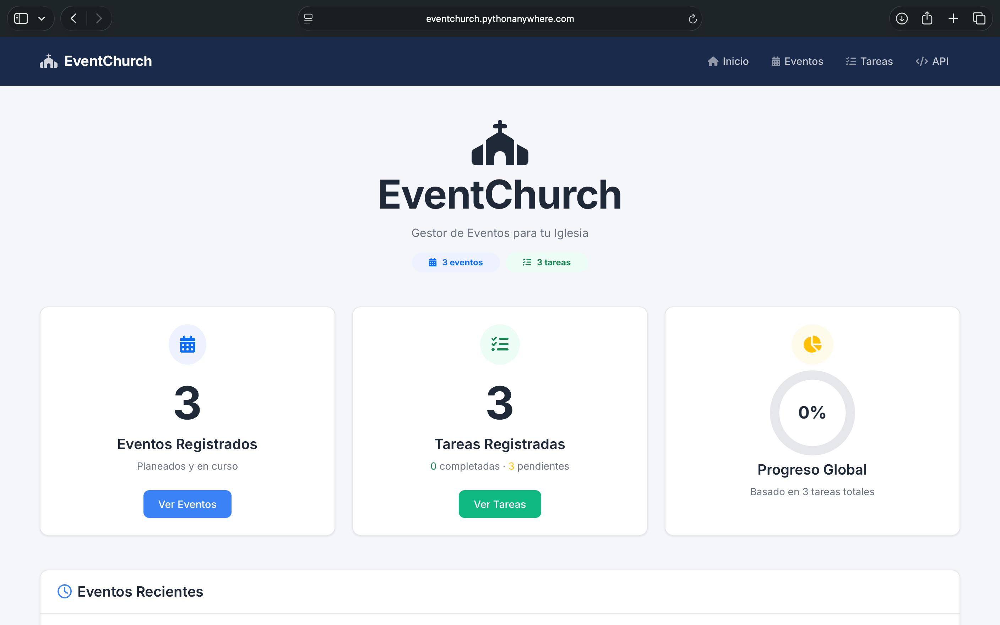

### Lista de eventos
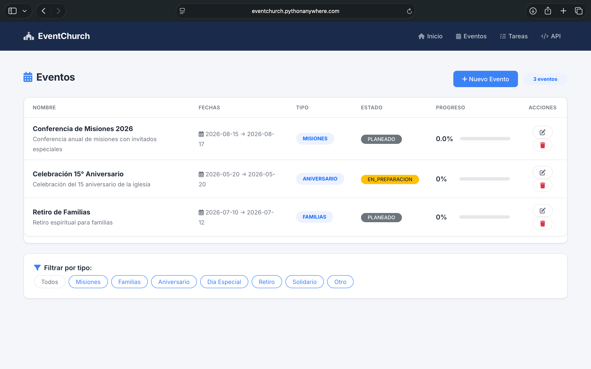

### Detalle de evento con tareas
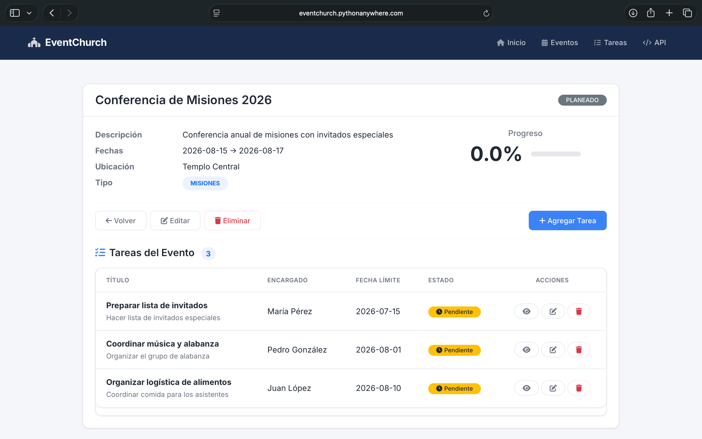

### Crear evento
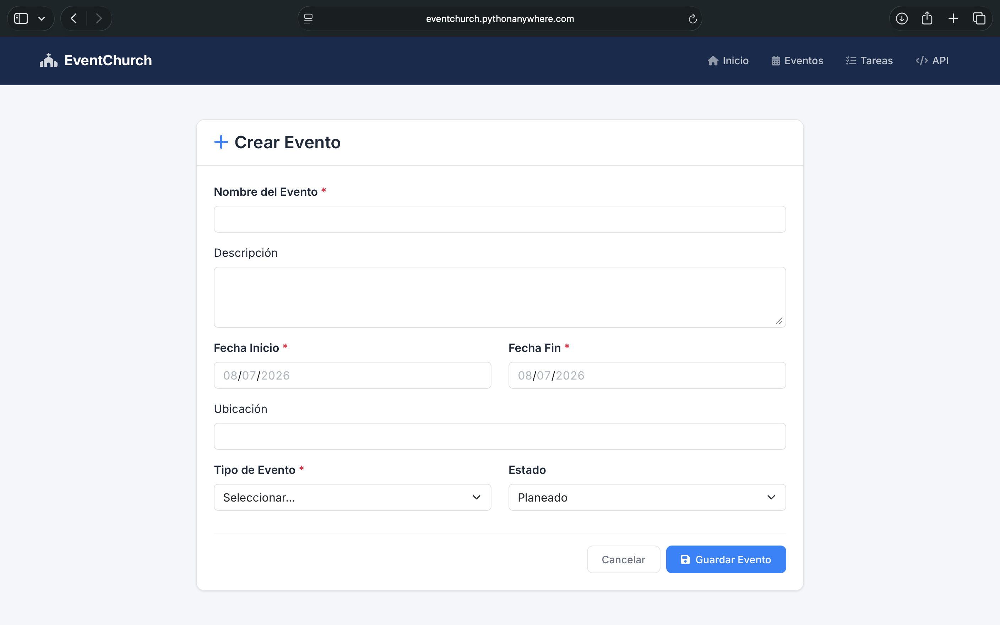

### Editar evento
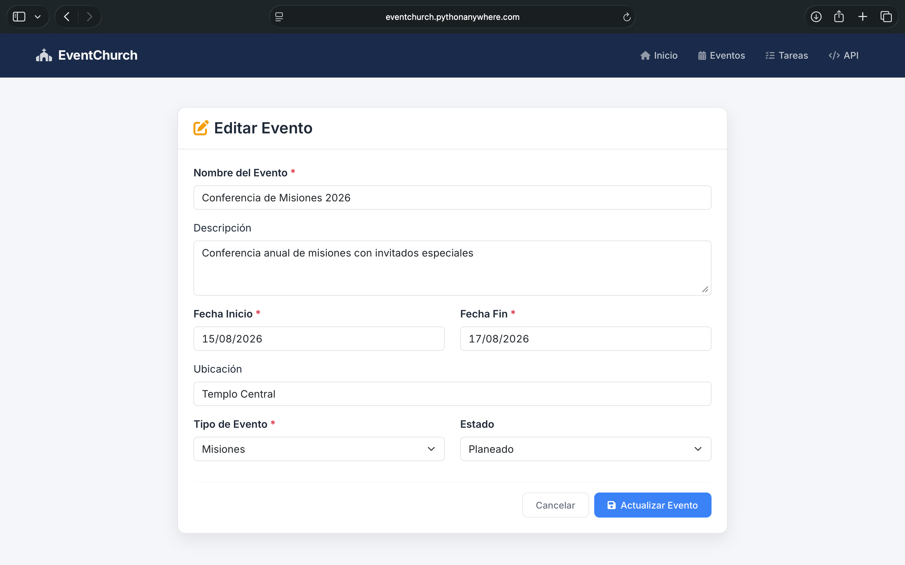

### Confirmar eliminar
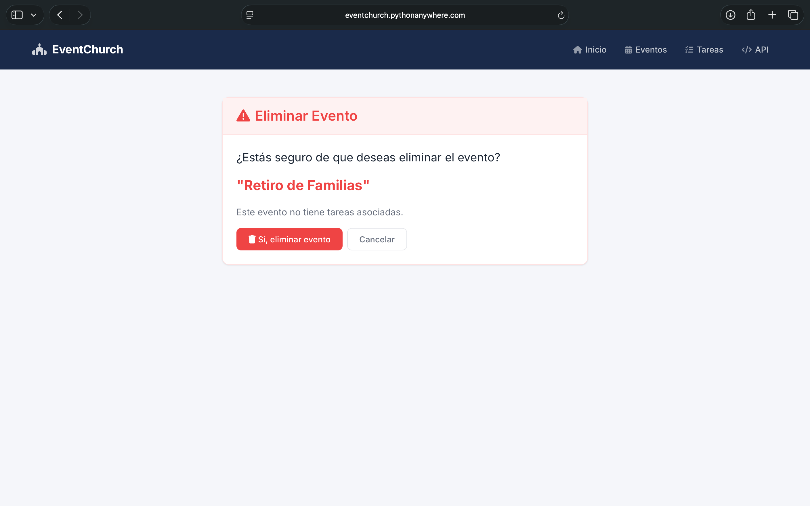

### Filtrar eventos
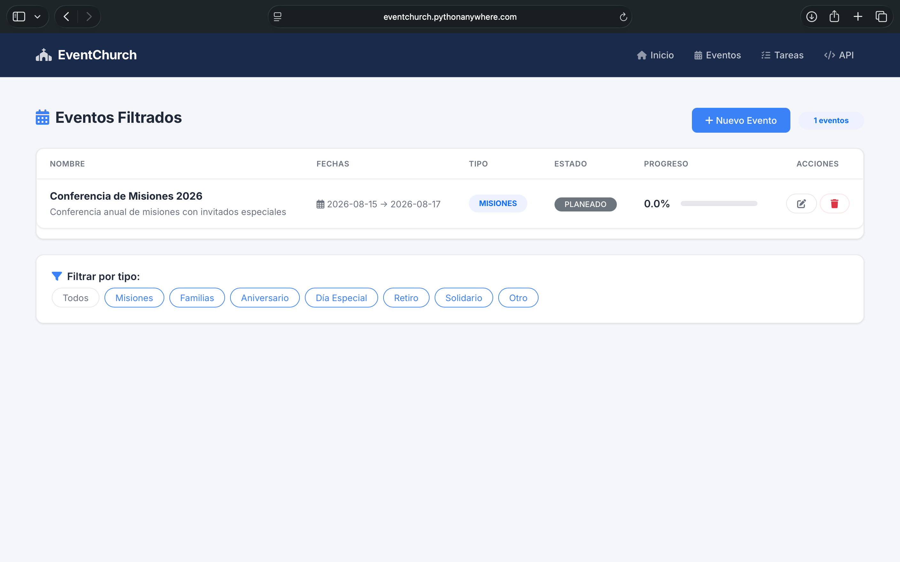

### Crear tarea
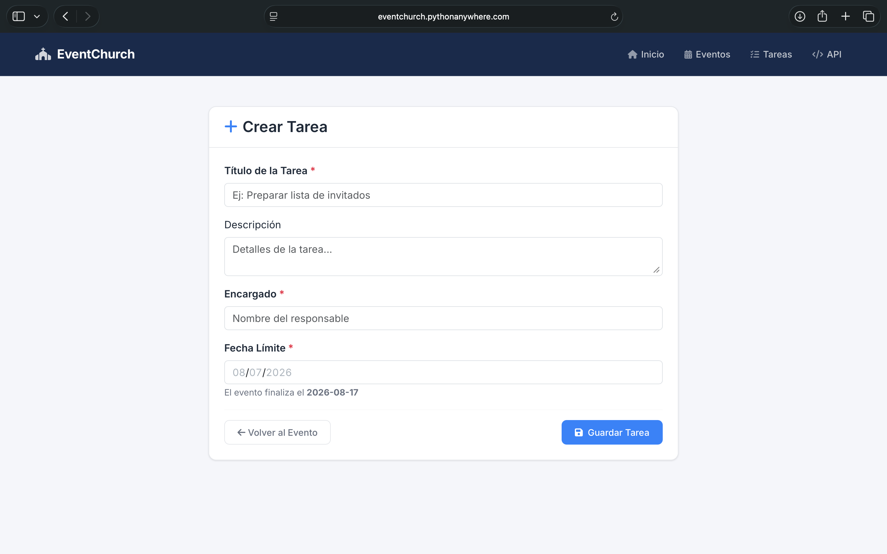

### API - Listar eventos (Postman)
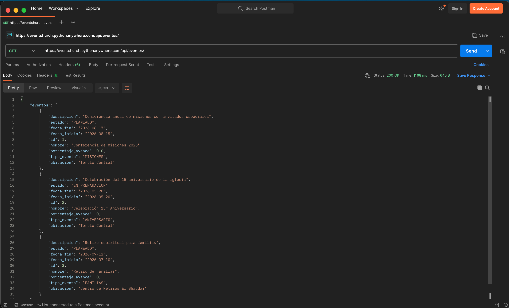

### API - Detalle de evento (Postman)
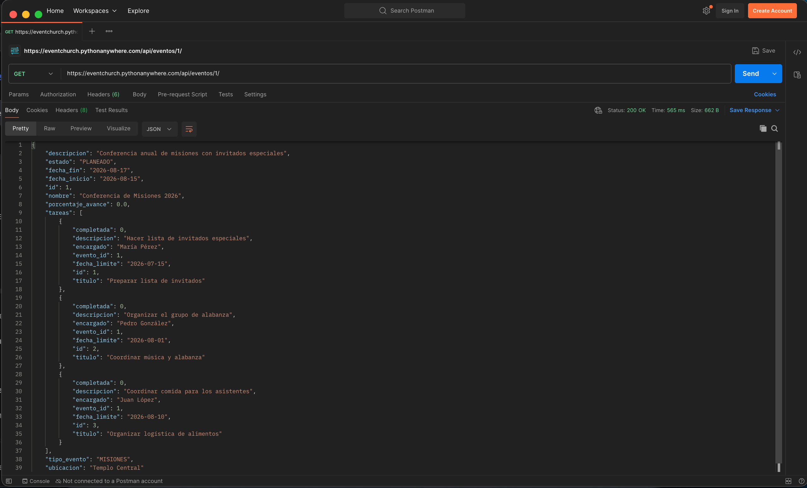

### API - Crear evento (Postman)
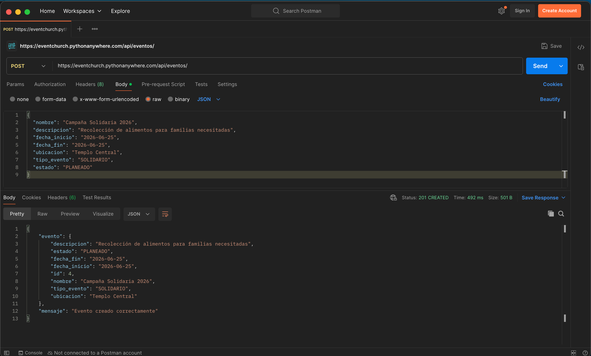

### API - Actualizar evento (Postman)
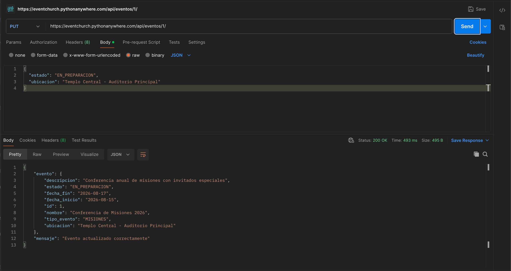

### API - Crear tarea (Postman)
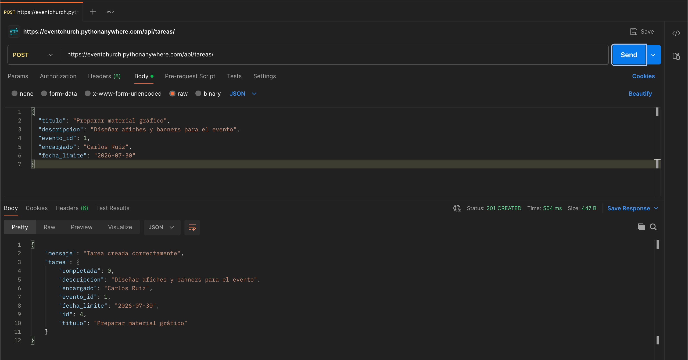

### API - Eliminar evento (Postman)
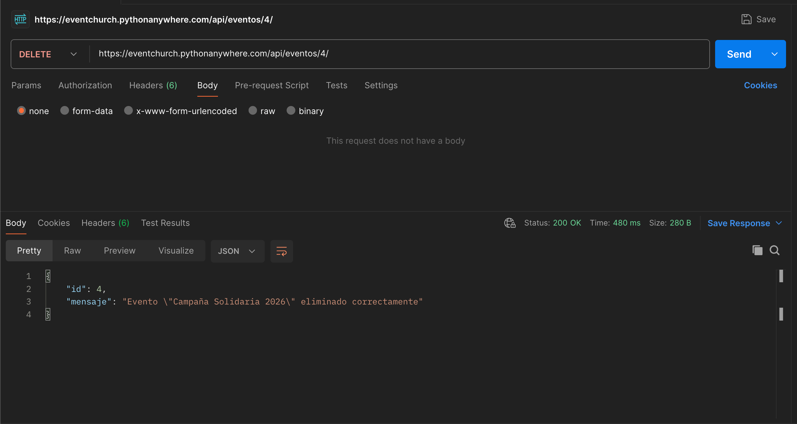

### Validación de error (Postman)
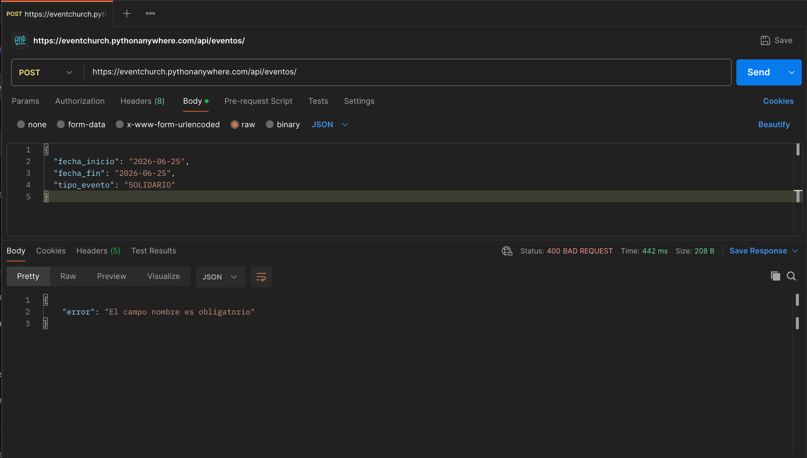

### API - Resumen (Postman)
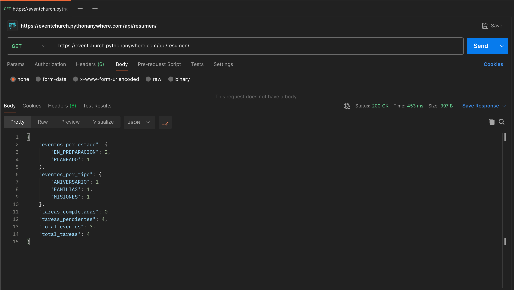

### Aplicación desplegada

## ⚙️ Variables de entorno

Para ejecutar localmente, no se requieren variables de entorno. La aplicación usa SQLite por defecto.

## 🛠️ Mejoras futuras

- Autenticación de usuarios (login)
- Asignación de múltiples encargados por tarea
- Notificaciones por correo electrónico
- Exportar eventos a PDF
- Comentarios en tareas
- Historial de cambios en eventos y tareas

---

**¡Gracias por visitar EventChurch!**